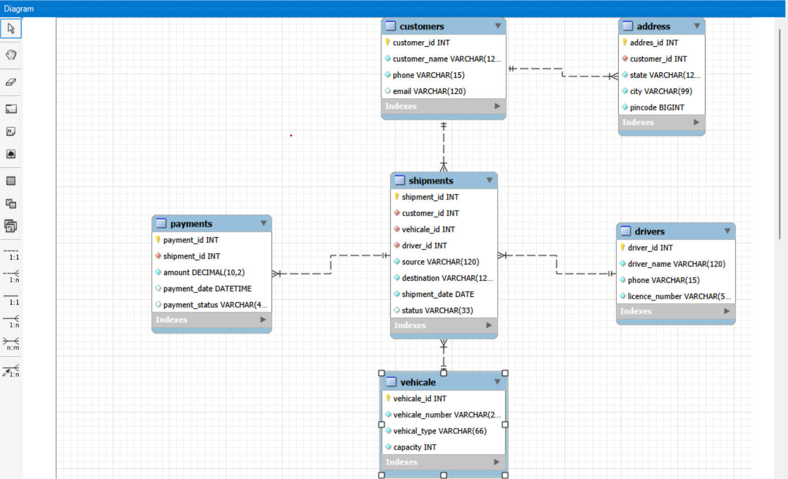

# 🚚 Transport Management System

A relational database project (MySQL) that models the core operations of a transport / logistics company — customers, their addresses, vehicles, drivers, shipments, and payments — along with a set of ready-to-use analytical queries.

---

## 📌 Overview

This project demonstrates database design and SQL querying for a transport business. It covers:

- Designing a normalized schema with primary and foreign keys
- Enforcing data integrity with `NOT NULL`, `UNIQUE`, and `DEFAULT` constraints
- Populating tables with sample data (15 records per table)
- Writing queries using `JOIN`s, `GROUP BY`, aggregate functions, subqueries, and filters

---

## 📁 Repository Structure

| File | Description |
|------|-------------|
| `Transport_Management_System.sql` | Creates the database and all tables, and inserts sample data |
| `Useful_Queries.sql` | Collection of practical queries for reporting and analysis |
| `ER_Diagram.png` | Entity-Relationship diagram of the database |
| `README.md` | Project documentation |

---

## 🗂️ Database Schema

The database `Transport_Management_System` contains **6 tables**:

### 1. `Customers`
| Column | Type | Constraints |
|--------|------|-------------|
| customer_id | INT | Primary Key, Auto Increment |
| customer_name | VARCHAR(120) | Not Null |
| phone | VARCHAR(15) | Not Null, Unique |
| email | VARCHAR(120) | Unique |

### 2. `address`
| Column | Type | Constraints |
|--------|------|-------------|
| addres_id | INT | Primary Key, Auto Increment |
| customer_id | INT | Foreign Key → Customers |
| state | VARCHAR(120) | Not Null |
| city | VARCHAR(99) | Not Null |
| pincode | BIGINT | Not Null |

### 3. `vehicale`
| Column | Type | Constraints |
|--------|------|-------------|
| vehicale_id | INT | Primary Key, Auto Increment |
| vehicale_number | VARCHAR(20) | Not Null, Unique |
| vehical_type | VARCHAR(66) | Not Null (Truck, Mini Truck, Trailer) |
| capacity | INT | Not Null |

### 4. `drivers`
| Column | Type | Constraints |
|--------|------|-------------|
| driver_id | INT | Primary Key, Auto Increment |
| driver_name | VARCHAR(120) | Not Null |
| phone | VARCHAR(15) | Not Null, Unique |
| licence_number | VARCHAR(55) | Not Null, Unique |

### 5. `shipments`
| Column | Type | Constraints |
|--------|------|-------------|
| shipment_id | INT | Primary Key, Auto Increment |
| customer_id | INT | Foreign Key → Customers |
| vehicale_id | INT | Foreign Key → vehicale |
| driver_id | INT | Foreign Key → drivers |
| source | VARCHAR(120) | Not Null |
| destination | VARCHAR(120) | Not Null |
| shipment_date | DATE | Not Null |
| status | VARCHAR(33) | Default `'BOOKED'` (BOOKED / IN_TRANSIT / DELIVERED) |

### 6. `payments`
| Column | Type | Constraints |
|--------|------|-------------|
| payment_id | INT | Primary Key, Auto Increment |
| shipment_id | INT | Foreign Key → shipments |
| amount | DECIMAL(10,2) | Not Null |
| payment_date | DATETIME | Default `CURRENT_TIMESTAMP` |
| payment_status | VARCHAR(44) | Default `'PENDING'` (PAID / PENDING) |

### 🔗 Relationships

```
Customers 1 ──── * address
Customers 1 ──── * shipments
vehicale  1 ──── * shipments
drivers   1 ──── * shipments
shipments 1 ──── * payments
```

See `ER_Diagram.png` for the visual diagram.



---

## ⚙️ Getting Started

### Prerequisites
- MySQL Server 8.x (or compatible, e.g. MariaDB)
- MySQL Workbench, DBeaver, or the MySQL command-line client

### Setup

1. **Clone the repository**
   ```bash
   git clone https://github.com/vishwanathzore4-png/Transport-Management-System.git
   cd Transport-Management-System
   ```

2. **Create the database, tables, and load sample data**
   ```bash
   mysql -u root -p < Transport_Management_System.sql
   ```

3. **Run the analytical queries**
   ```bash
   mysql -u root -p Transport_Management_System < Useful_Queries.sql
   ```

   Or open the `.sql` files in MySQL Workbench and execute them there.

---

## 🔍 Sample Queries

`Useful_Queries.sql` includes queries for the following:

**Customers & Addresses**
- Display all customers
- Customers located in Maharashtra (subquery)
- Customer details with city, state, and pincode (JOIN)

**Vehicles & Drivers**
- Vehicles with capacity greater than 10,000
- Drivers whose name starts with `R` (`LIKE`)
- Driver workload — number of shipments per driver (`LEFT JOIN`)

**Shipments**
- Delivered shipments only
- Shipment count by status (`GROUP BY`)
- Shipments from / to a specific city
- Shipments within a date range (`BETWEEN`)
- Full shipment details with customer, vehicle, and driver (multi-table JOIN)

**Payments**
- Total payment amount and paid vs. pending totals
- Highest and lowest payments (subquery)
- Shipments with pending payments
- Total payment amount by shipment status

### Example

```sql
-- Full shipment details with customer, vehicle and driver
SELECT
    s.shipment_id,
    c.customer_name,
    v.vehicale_number,
    d.driver_name,
    s.source,
    s.destination,
    s.status
FROM shipments s
JOIN customers c ON s.customer_id = c.customer_id
JOIN vehicale  v ON s.vehicale_id = v.vehicale_id
JOIN drivers   d ON s.driver_id   = d.driver_id;
```

---

## 🛠️ Tech Stack

- **Database:** MySQL
- **Language:** SQL (DDL, DML, DQL)
- **Concepts:** Primary/Foreign Keys, Constraints, Joins, Aggregations, Subqueries

---

## 🚀 Future Enhancements

- Add stored procedures and triggers (e.g., auto-update shipment status on payment)
- Create views for common reports
- Add indexes for query performance
- Track vehicle maintenance and fuel records
- Build a front-end or REST API on top of the database

---

## 🤝 Contributing

Contributions, issues, and feature requests are welcome! Feel free to fork the repo and open a pull request.

---

## 👤 Author

**Vishwanath Zore**
GitHub: [@vishwanathzore4-png](https://github.com/vishwanathzore4-png)

---

⭐ If you found this project helpful, consider giving it a star!
